# Bizentra Technical Architecture — Mermaid Diagrams

**Purpose:** Provide implementation-ready Mermaid diagrams for the selected Bizentra technologies, application boundaries, data flow, repository dependencies, offline synchronization, and deployment process.

These diagrams follow the decisions in:

- [`00_TECHNOLOGY_STACK_INDEX.md`](./00_TECHNOLOGY_STACK_INDEX.md)
- [`01_ARCHITECTURE_RECOMMENDATION.md`](./01_ARCHITECTURE_RECOMMENDATION.md)
- [`06_ARCHITECTURE_TUTORIAL_AND_DEPLOYMENT_GUIDE.md`](./06_ARCHITECTURE_TUTORIAL_AND_DEPLOYMENT_GUIDE.md)

---

## 1. Complete Technology and Deployment Architecture

```mermaid
flowchart TB
    subgraph ACTORS["Users and Store Devices"]
        CASHIER["Cashier / Sales User"]
        MANAGER["Owner / Manager / Inventory / Finance User"]
        DEVICES["Scanner / Scale / Printer / Cash Drawer / Payment Terminal"]
    end

    subgraph EDGE["Internet Edge"]
        DNS["DNS + TLS Certificates"]
        CDN["CDN + WAF + Rate Protection"]
    end

    subgraph FRONTEND["Independent Frontend Deployables"]
        POS["POS Application<br/>Next.js 16 + React + TypeScript<br/>pos.example.com"]
        LOCALDB["Offline Store<br/>Dexie + IndexedDB<br/>Pending Commands + Catalog Snapshot"]
        DEVICEPORT["Device Adapter Layer<br/>Web APIs / Vendor SDK / Local Bridge"]
        BACKOFFICE["Back Office Application<br/>Next.js 16 + React + TypeScript<br/>app.example.com"]
        BFF["Frontend BFF<br/>Next.js Route Handlers<br/>Session / Proxy / Response Shaping"]
    end

    subgraph IDENTITY["Identity"]
        IDP["OIDC Identity Provider<br/>Keycloak or Managed OIDC<br/>Login + MFA + Passkeys + Federation"]
    end

    subgraph APPLICATION["Core Application Deployables"]
        GATEWAY["API Load Balancer"]
        API["Core API Replicas<br/>NestJS + Fastify + Node.js 24 LTS<br/>REST + OpenAPI"]
        AUTHZ["Business Context + Authorization<br/>Business / Branch / Role / Approval"]
        DOMAINS["Domain-Modular Monolith<br/>Catalog | Pricing | Sales | Payments<br/>Inventory | Purchasing | Finance<br/>CRM | Loyalty | Operations | Integrations"]
        WORKER["Worker Replicas<br/>NestJS Application Context + BullMQ<br/>Outbox / Jobs / Schedules / Reconciliation"]
        REALTIME["Optional Realtime Gateway<br/>WebSocket / Server-Sent Events"]
    end

    subgraph DATA["Managed Data Services"]
        POOL["PgBouncer-Compatible<br/>Transaction Pool"]
        PRISMA["Prisma ORM 7 GA<br/>Repositories + Unit of Work"]
        POSTGRES["PostgreSQL 18<br/>Authoritative OLTP Database<br/>Ledgers + Audit + Transactional Outbox"]
        REDIS["Redis-Compatible Service<br/>BullMQ + Cache + Rate Limits"]
        OBJECTS["S3-Compatible Object Storage<br/>Images + Attachments + Imports + Exports"]
        REPLICA["Optional Read Replica<br/>Only After Measured Need"]
    end

    subgraph EXTERNAL["External Providers and Systems"]
        PAYMENT["Payment Gateway / Certified Terminal"]
        MESSAGE["Email / SMS / Notification Provider"]
        ACCOUNTING["Accounting / ERP / Marketplace"]
        WEBHOOKS["Customer Webhook Endpoints"]
    end

    subgraph OPERATIONS["Platform and Operations"]
        CONTAINERS["Managed Container Platform<br/>Immutable Docker Images"]
        SECRETS["Secret Manager + KMS"]
        OTEL["OpenTelemetry Collector<br/>Logs + Metrics + Traces"]
        MONITORING["Dashboards + Alerts + Error Tracking"]
        IAC["OpenTofu / Terraform-Compatible IaC"]
        BACKUP["PostgreSQL HA + PITR + Restore Tests"]
    end

    CASHIER --> DNS
    MANAGER --> DNS
    DNS --> CDN
    CDN --> POS
    CDN --> BACKOFFICE

    DEVICES <--> DEVICEPORT
    DEVICEPORT <--> POS
    POS <--> LOCALDB

    POS -->|"OIDC login"| IDP
    BACKOFFICE -->|"OIDC login"| IDP
    POS -->|"HTTPS / Generated OpenAPI Client"| GATEWAY
    BACKOFFICE --> BFF
    BFF -->|"HTTPS / Generated OpenAPI Client"| GATEWAY

    GATEWAY --> API
    API -->|"Validate token"| IDP
    API --> AUTHZ
    AUTHZ --> DOMAINS
    WORKER --> DOMAINS

    DOMAINS --> PRISMA
    PRISMA --> POOL
    POOL --> POSTGRES
    WORKER -->|"Claim outbox / domain work"| POSTGRES
    WORKER <--> REDIS
    API <--> REDIS
    API <--> OBJECTS
    WORKER <--> OBJECTS
    POSTGRES -.-> REPLICA

    DOMAINS -->|"Payment intent / verification"| PAYMENT
    PAYMENT -->|"Signed callback / reconciliation"| API
    WORKER --> MESSAGE
    WORKER --> ACCOUNTING
    WORKER --> WEBHOOKS
    WORKER -->|"Committed status updates"| REALTIME
    REALTIME --> POS
    REALTIME --> BACKOFFICE

    CONTAINERS -.-> POS
    CONTAINERS -.-> BACKOFFICE
    CONTAINERS -.-> API
    CONTAINERS -.-> WORKER
    SECRETS -.-> API
    SECRETS -.-> WORKER
    API -.-> OTEL
    WORKER -.-> OTEL
    POS -.-> OTEL
    BACKOFFICE -.-> OTEL
    OTEL --> MONITORING
    IAC -.-> CDN
    IAC -.-> API
    IAC -.-> POSTGRES
    POSTGRES --> BACKUP

    classDef actor fill:#E8F1FF,stroke:#2563EB,color:#0F172A
    classDef frontend fill:#ECFDF5,stroke:#059669,color:#0F172A
    classDef application fill:#FFF7ED,stroke:#EA580C,color:#0F172A
    classDef data fill:#F5F3FF,stroke:#7C3AED,color:#0F172A
    classDef external fill:#FEF2F2,stroke:#DC2626,color:#0F172A
    classDef operations fill:#F8FAFC,stroke:#475569,color:#0F172A

    class CASHIER,MANAGER,DEVICES actor
    class POS,LOCALDB,DEVICEPORT,BACKOFFICE,BFF frontend
    class GATEWAY,API,AUTHZ,DOMAINS,WORKER,REALTIME application
    class POOL,PRISMA,POSTGRES,REDIS,OBJECTS,REPLICA data
    class PAYMENT,MESSAGE,ACCOUNTING,WEBHOOKS external
    class CONTAINERS,SECRETS,OTEL,MONITORING,IAC,BACKUP operations
```

### Main diagram rules

- POS and Back Office are separate Next.js deployments.
- The browser never connects directly to PostgreSQL, Prisma, Redis, or object-storage credentials.
- Next.js Route Handlers are a BFF, not the owner of core business rules.
- NestJS/Fastify owns authorization, application use cases, transactions, and stable APIs.
- PostgreSQL is the source of truth for sales, payments, stock, finance, loyalty, audit, and outbox records.
- Redis/BullMQ owns queued work, not authoritative business balances.
- Workers perform retryable and slow work after critical transactions commit.
- All production components send safe telemetry through OpenTelemetry.

---

## 2. Domain-Modular Monolith Architecture

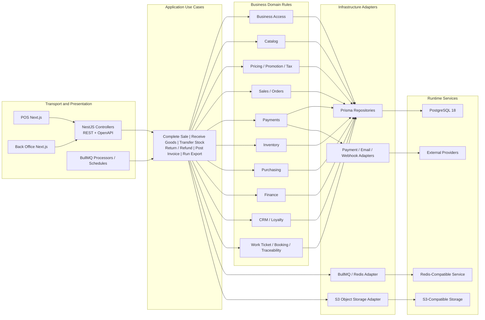

### Dependency direction

```text
Transport -> Application -> Domain -> Ports <- Infrastructure Adapters
```

Domain rules shall not import Next.js, NestJS controllers, Prisma Client, Redis clients, or provider SDKs.

---

## 3. Monorepo Folder and Package Dependency Diagram

```mermaid
flowchart TB
    subgraph APPS["Deployable Applications"]
        POS["apps/pos<br/>Next.js POS"]
        BO["apps/backoffice<br/>Next.js Back Office"]
        API["apps/api<br/>NestJS/Fastify API"]
        WORKER["apps/worker<br/>NestJS/BullMQ Worker"]
    end

    subgraph SHARED["Shared Build-Time Packages"]
        UI["packages/design-system"]
        CLIENT["packages/api-client<br/>Generated from OpenAPI"]
        CONTRACTS["packages/contracts"]
        AUTH["packages/auth"]
        OFFLINE["packages/offline"]
        OBS["packages/observability"]
        DB["packages/database<br/>Prisma Schema + Migrations"]
        MONEY["packages/money"]
        IDS["packages/ids"]
    end

    subgraph DOMAINS["Domain Packages"]
        ACCESS["packages/domains/business-access"]
        CATALOG["packages/domains/catalog"]
        SALES["packages/domains/sales"]
        PAYMENTS["packages/domains/payments"]
        INVENTORY["packages/domains/inventory"]
        FINANCE["packages/domains/finance"]
        MORE["other domain packages"]
    end

    subgraph PACKS["Business-Pack Extensions"]
        GROCERY["packages/packs/grocery"]
        RETAIL["packages/packs/general-retail"]
        FUTURE["packages/packs/fashion and later packs"]
    end

    POS --> UI
    POS --> CLIENT
    POS --> CONTRACTS
    POS --> AUTH
    POS --> OFFLINE
    POS --> OBS

    BO --> UI
    BO --> CLIENT
    BO --> CONTRACTS
    BO --> AUTH
    BO --> OBS

    API --> ACCESS
    API --> CATALOG
    API --> SALES
    API --> PAYMENTS
    API --> INVENTORY
    API --> FINANCE
    API --> MORE
    API --> CONTRACTS
    API --> AUTH
    API --> OBS
    API --> DB

    WORKER --> SALES
    WORKER --> PAYMENTS
    WORKER --> INVENTORY
    WORKER --> FINANCE
    WORKER --> MORE
    WORKER --> CONTRACTS
    WORKER --> OBS
    WORKER --> DB

    DOMAINS --> MONEY
    DOMAINS --> IDS
    GROCERY --> CATALOG
    GROCERY --> SALES
    RETAIL --> CATALOG
    RETAIL --> SALES
    FUTURE --> MORE

    FORBIDDEN["Forbidden:<br/>Frontend -> Prisma/Database<br/>App -> another App source<br/>Pack -> duplicate ledger"]
    POS -.->|"Forbidden"| FORBIDDEN
    BO -.->|"Forbidden"| FORBIDDEN
    GROCERY -.->|"Forbidden duplicate ledger"| FORBIDDEN
    RETAIL -.->|"Forbidden duplicate ledger"| FORBIDDEN
    FUTURE -.->|"Forbidden duplicate ledger"| FORBIDDEN

    classDef app fill:#ECFDF5,stroke:#059669,color:#0F172A
    classDef pkg fill:#EFF6FF,stroke:#2563EB,color:#0F172A
    classDef domain fill:#FFF7ED,stroke:#EA580C,color:#0F172A
    classDef pack fill:#F5F3FF,stroke:#7C3AED,color:#0F172A
    classDef forbidden fill:#FEF2F2,stroke:#DC2626,color:#7F1D1D

    class POS,BO,API,WORKER app
    class UI,CLIENT,CONTRACTS,AUTH,OFFLINE,OBS,DB,MONEY,IDS pkg
    class ACCESS,CATALOG,SALES,PAYMENTS,INVENTORY,FINANCE,MORE domain
    class GROCERY,RETAIL,FUTURE pack
    class FORBIDDEN forbidden
```

### Repository connection rule

Applications consume packages through declared package exports. They do not import private source files using relative paths across package boundaries.

---

## 4. Completed Sale — Transaction and Event Sequence

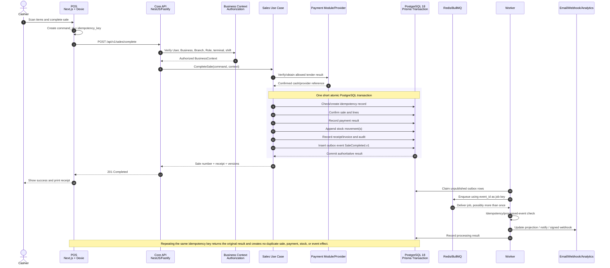

---

## 5. Offline POS Synchronization Sequence

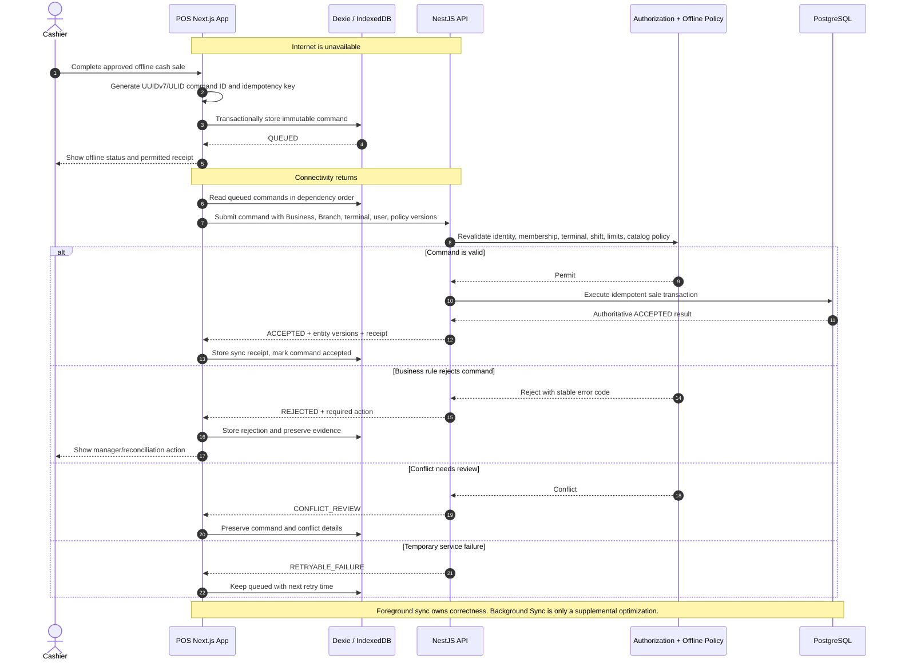

---

## 6. Payment Timeout and Reconciliation Sequence

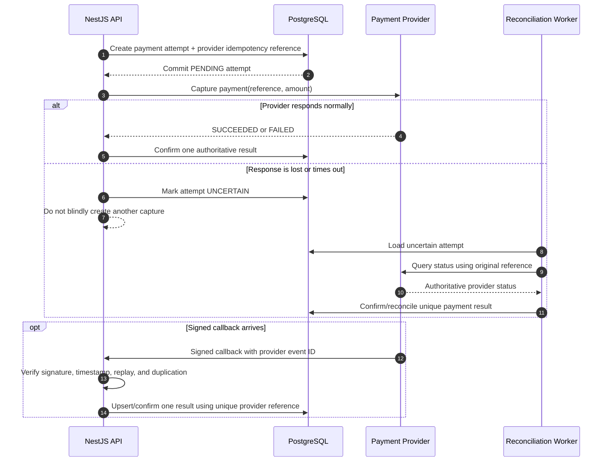

---

## 7. CI/CD and Independent Deployment Architecture

```mermaid
flowchart LR
    DEV["Developer Change"] --> PR["Pull Request"]

    subgraph CI["CI Quality Pipeline"]
        INSTALL["pnpm Frozen Install"]
        TURBO["Turborepo Affected Graph"]
        QUALITY["Format + Lint + Typecheck<br/>Architecture Boundaries"]
        TESTS["Vitest + Testing Library<br/>PostgreSQL/Redis Integration<br/>Playwright + Contract Tests"]
        SECURITY["Secret + Dependency + SAST<br/>Container Scan + SBOM"]
        BUILD["Build Affected Apps"]
    end

    PR --> INSTALL --> TURBO --> QUALITY --> TESTS --> SECURITY --> BUILD

    BUILD --> REGISTRY["Signed Immutable Images<br/>Container Registry"]
    BUILD --> WEBARTIFACT["Next.js Web Artifacts"]

    subgraph STAGING["Staging"]
        STGMIGRATE["Controlled Prisma Migrate Deploy<br/>Direct PostgreSQL Connection"]
        STGAPPS["Deploy POS / Back Office / API / Worker"]
        STGVERIFY["Smoke + E2E + Performance<br/>Migration + Failure Tests"]
    end

    REGISTRY --> STGMIGRATE
    WEBARTIFACT --> STGAPPS
    STGMIGRATE --> STGAPPS --> STGVERIFY

    STGVERIFY --> APPROVAL["Production Approval"]

    subgraph PROD["Production Rolling/Canary Release"]
        PRODMIGRATE["Safe Additive Migration Job"]
        APIWORKER["API + Worker Canary/Rolling Deploy"]
        OBSERVE["Observe SLOs, Errors, Outbox,<br/>Payments, Stock, Sync"]
        FRONTENDS["Deploy Compatible POS and Back Office"]
        PROMOTE["Promote or Roll Back / Forward-Fix"]
    end

    APPROVAL --> PRODMIGRATE --> APIWORKER --> OBSERVE --> FRONTENDS --> PROMOTE

    classDef ci fill:#EFF6FF,stroke:#2563EB,color:#0F172A
    classDef staging fill:#FFF7ED,stroke:#EA580C,color:#0F172A
    classDef prod fill:#ECFDF5,stroke:#059669,color:#0F172A

    class INSTALL,TURBO,QUALITY,TESTS,SECURITY,BUILD ci
    class STGMIGRATE,STGAPPS,STGVERIFY staging
    class PRODMIGRATE,APIWORKER,OBSERVE,FRONTENDS,PROMOTE prod
```

### Deployment units

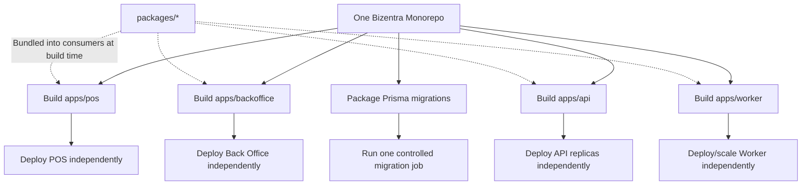

---

## 8. Safe Database Migration Sequence

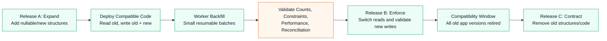

Never run destructive schema changes before every deployed application version is compatible.

---

## 9. Business Data Isolation Architecture

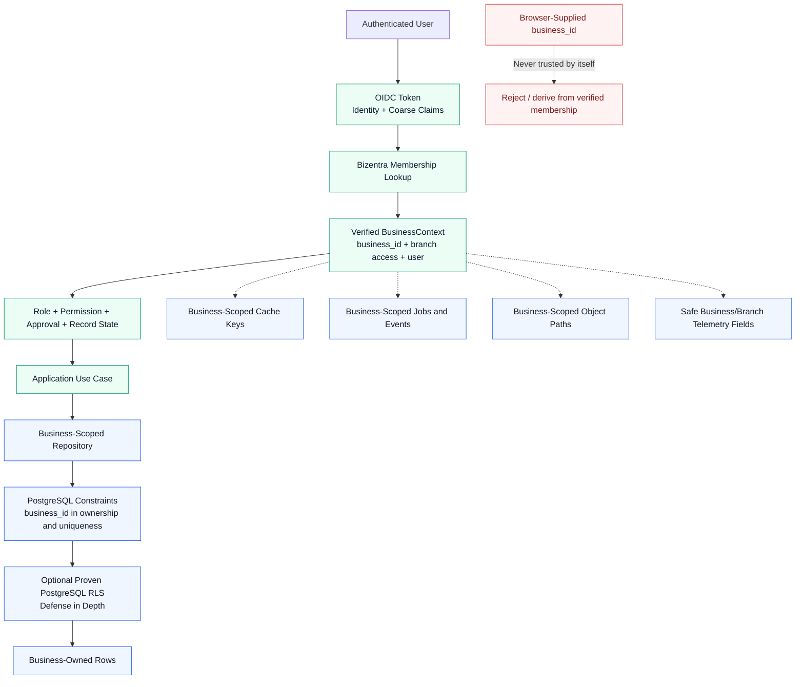

---

## 10. Architecture Summary

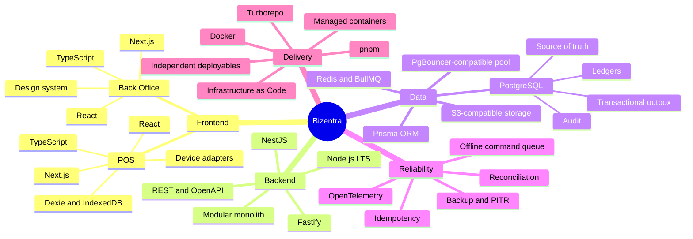

The main rule is:

```text
Frontend asks -> API authorizes and decides -> PostgreSQL commits the truth
-> Outbox and workers complete retryable side effects -> Telemetry and reconciliation prove the result
```
